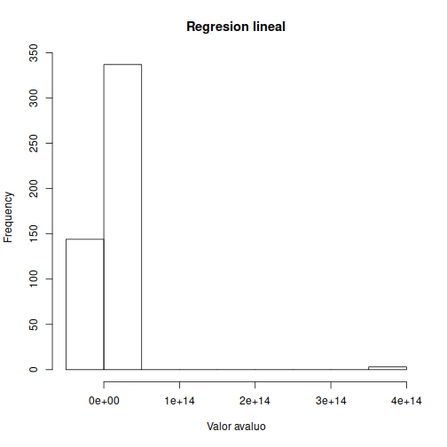
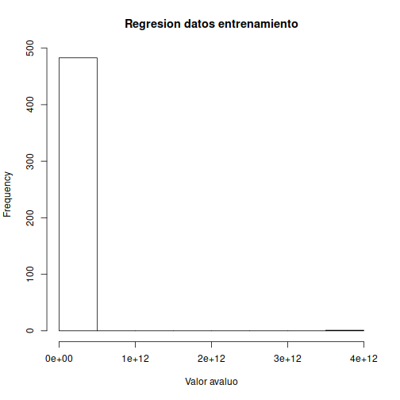
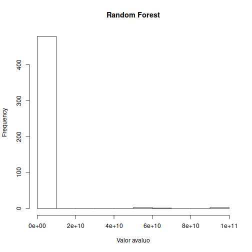
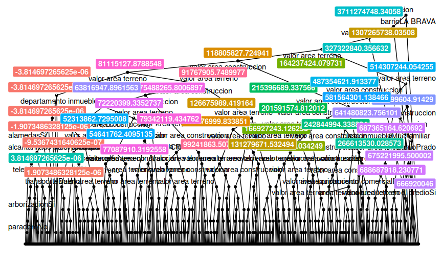

# Precios Hedonicos

Los precios hedonicos tienen las siguientes caracteristicas:

* Precios hedónicos cuando se venden en el mercado bienes diferenciados por el atributo de calidad.
* Modelos hedónicos hacen parte de valoración de no mercado por que los bienes y servicios ocasionalmente tienen calidades que no proporciona el mercado. Muchas de las aplicaciones ambientales se relacionan con precios de vivienda, aunque modelos de salarios hedónicos se han usado para modelar la disponibilidad a pagar por evitar un riesgo.
* La modelación consiste en usar la variación sistemática en precios de los bienes que es atribuida a las características de los bienes para obtener la disponibilidad a pagar por esas características.

El modelo de los precios hedonicos varia de acuerdo a sus caractaresticas, cada una de estas caracteristicas a evaluar es una variable dentro de la funcion de asignacion de precio.

P = f(caracteristica1, caracteristica2, caracteristica3, ..., caracteristicaN)
---
# Calculo de los precios

Para poder calcular el valor del precio se debe verificar que no exista colinealidad entre las variables, se puede calcular por varios metodos los cuales estan basadas en la regresion lineal multivariable aplicando diferentes tecnicas o se puede realizar.

En este ejemplo vamos a calcular el precio de avaluo de viviendo en base a datos numericos de valoracion de area y a datos de caracteristicas.


```r
df <- read.xlsx("precio_vivienda.xlsx")

df <- as.data.frame(unclass(df),stringsAsFactors = TRUE)
str(df)
```

```
## 'data.frame':	1616 obs. of  40 variables:
##  $ objeto                      : Factor w/ 4 levels "2018-06-19 19:48:27.269-05",..: 3 3 3 3 3 3 4 3 3 3 ...
##  $ motivo                      : Factor w/ 15 levels "Actualización de garantías",..: 10 6 6 6 6 6 15 6 6 6 ...
##  $ proposito                   : Factor w/ 7 levels "0","Crédito hipotecario de vivienda",..: 4 4 4 4 4 4 4 4 4 4 ...
##  $ tipo_avaluo                 : Factor w/ 3 levels "Garantía Hipotecaria",..: 2 2 2 2 2 2 3 2 2 2 ...
##  $ tipo_credito                : Factor w/ 3 levels "Diferente de Vivienda",..: 3 3 3 3 3 3 1 3 3 3 ...
##  $ departamento_inmueble       : Factor w/ 47 levels "Alicia Maria Velez Restrepo",..: 43 34 45 45 20 44 28 23 24 7 ...
##  $ municipio_inmueble          : Factor w/ 296 levels "ABREGO","ABRIAQUI",..: 254 177 272 41 198 53 4 165 100 259 ...
##  $ barrio                      : Factor w/ 1309 levels "12 de Octubre",..: 583 574 142 299 501 174 1220 1108 1279 584 ...
##  $ sector                      : Factor w/ 10 levels "Bifamiliar Cortés",..: 9 9 9 9 9 9 6 9 9 9 ...
##  $ alcantarillado_en_el_sector : Factor w/ 4 levels "0","4.3346261000000004",..: 4 4 4 4 4 4 3 4 4 4 ...
##  $ acueducto_en_el_sector      : Factor w/ 2 levels "No","Si": 2 2 2 2 2 2 2 2 2 2 ...
##  $ gas_en_el_sector            : Factor w/ 2 levels "No","Si": 2 2 2 2 2 2 1 2 2 2 ...
##  $ energia_en_el_sector        : Factor w/ 2 levels "No","Si": 2 2 2 2 2 2 2 2 2 2 ...
##  $ telefono_en_el_sector       : Factor w/ 2 levels "No","Si": 2 2 2 2 2 2 1 2 2 2 ...
##  $ vias_pavimentadas           : Factor w/ 2 levels "No","Si": 2 1 1 2 2 1 1 2 2 2 ...
##  $ sardineles_en_las_vias      : Factor w/ 2 levels "No","Si": 2 1 1 2 2 1 1 2 2 2 ...
##  $ andenes_en_las_vias         : Factor w/ 2 levels "No","Si": 2 2 2 2 2 2 1 2 2 2 ...
##  $ barrio_legal                : Factor w/ 6 levels "3","4","5","6",..: 6 6 6 6 6 6 6 6 6 6 ...
##  $ topografia_sector           : Factor w/ 5 levels "Accidentada",..: 4 4 4 4 4 3 2 4 3 4 ...
##  $ condiciones_salubridad      : Factor w/ 5 levels "Buenas","Inclinado",..: 1 1 1 1 1 1 1 1 1 1 ...
##  $ transporte                  : Factor w/ 4 levels "Buenas","Bueno",..: 2 2 2 2 2 4 2 2 2 2 ...
##  $ demanda_interes             : Factor w/ 6 levels "Débil","Débil",..: 4 4 4 4 4 4 2 4 3 5 ...
##  $ paradero                    : Factor w/ 4 levels "Fuerte","Media",..: 3 4 3 4 3 4 3 4 4 4 ...
##  $ alumbrado                   : Factor w/ 2 levels "No","Si": 2 2 2 2 2 2 1 2 2 2 ...
##  $ arborizacion                : Factor w/ 2 levels "No","Si": 2 1 2 2 1 2 2 1 2 2 ...
##  $ alamedas                    : Factor w/ 2 levels "No","Si": 1 1 1 1 1 1 1 1 1 2 ...
##  $ ciclo_rutas                 : Factor w/ 2 levels "No","Si": 1 1 1 1 1 1 1 1 1 2 ...
##  $ nivel_equipamiento_comercial: Factor w/ 6 levels "Bueno","En Proyecto",..: 1 1 5 1 1 1 1 5 1 3 ...
##  $ alcantarillado_en_el_predio : Factor w/ 50 levels "\"Actualmente la actividad edificadora es buena, se encuentra planteado la construcción futura de proyectos de "| __truncated__,..: 50 50 50 50 50 50 40 50 50 48 ...
##  $ acueducto_en_el_predio      : Factor w/ 13 levels "\"Del análisis del segmento de mercado relativo a los inmuebles comparables que se valora se deduce que la ofer"| __truncated__,..: 13 13 13 13 13 13 13 13 13 12 ...
##  $ gas_en_el_predio            : Factor w/ 5 levels "\"Del análisis del segmento del mercado relativo a inmuebles comparables con el que se valora deducimos que hay"| __truncated__,..: 5 5 5 5 5 5 3 5 5 4 ...
##  $ energia_en_el_predio        : Factor w/ 3 levels "0","No","Si": 3 3 3 3 3 3 3 3 3 2 ...
##  $ telefono_en_el_predio       : Factor w/ 3 levels "0","No","Si": 2 2 2 3 2 2 1 3 2 2 ...
##  $ tipo_inmueble               : Factor w/ 9 levels "Apartamento",..: 2 2 2 2 2 2 5 2 2 2 ...
##  $ clase_inmueble              : Factor w/ 17 levels "0","3 HABITACIONES, ALBERCA LAVADE",..: 13 13 13 13 13 13 9 13 13 13 ...
##  $ area_terreno                : num  154 36 92.5 258.7 203 ...
##  $ valor_area_terreno          : num  2.77e+07 2.88e+07 3.24e+07 1.60e+08 3.45e+07 ...
##  $ area_construccion           : num  92 63.6 77.9 131.4 135 ...
##  $ valor_area_construccion     : num  49774000 49290000 28823000 55109190 62100000 ...
##  $ valor_total_avaluo          : num  8.71e+07 7.81e+07 6.12e+07 2.16e+08 9.66e+07 ...
```
---
## Regresion Lineal

Debemos verificar el valor de Rsquared que nos da la aproximacion del modelo.


```r
entrenamiento <- createDataPartition(df$valor_total_avaluo, p=0.7, list = FALSE)
trainModel <- df[entrenamiento,]
trainTest <- df[-entrenamiento,]

modelo2 <- train(valor_total_avaluo ~ ., data = trainModel, method = "lm", trControl = trainControl(method = "boot", 7), ntree = 14)
modelo2
```

```
## Linear Regression 
## 
## 1132 samples
##   39 predictor
## 
## No pre-processing
## Resampling: Bootstrapped (7 reps) 
## Summary of sample sizes: 1132, 1132, 1132, 1132, 1132, 1132, ... 
## Resampling results:
## 
##   RMSE          Rsquared   MAE         
##   1.594628e+13  0.3042998  3.011714e+12
## 
## Tuning parameter 'intercept' was held constant at a value of TRUE
```
---
## Random Forest

Este modelo realiza una clasificacion por arbol a nivel de probabilidades sobre los datos no numericos y da una ponderacion a los datos numericos, debemos verificar el valor de Rsquared que nos da la aproximacion del modelo.


```r
modelo1 <- train(valor_total_avaluo ~ ., data = trainModel, method = "rf", trControl = trainControl(method = "cv", 7), ntree = 14)
modelo1
```

```
## Random Forest 
## 
## 1132 samples
##   39 predictor
## 
## No pre-processing
## Resampling: Cross-Validated (7 fold) 
## Summary of sample sizes: 970, 970, 971, 970, 972, 970, ... 
## Resampling results across tuning parameters:
## 
##   mtry  RMSE         Rsquared   MAE       
##      2  49951269379  0.1434427  8879632189
##     60  49000648378  0.1735492  7214612658
##   1824  15968310187  0.9630413  1503254999
## 
## RMSE was used to select the optimal model using the smallest value.
## The final value used for the model was mtry = 1824.
```
---
# Calculo de prediccion del modelo e histograma

Vamos a realizar el calculo sobre la data de prueba y verificar que tanto se aproxima el modelo.


```r
trainTest$prediccion2 <- predict(modelo2, trainTest)
trainTest$prediccion1 <- predict(modelo1, trainTest)
```
---
# Histogramas y datos estadisticos sobre la informacion

Vamos a realizar el histograma sobre cada prediccion y el analisis estadistico de la informacion.

## Datos estadisticos de modelo lineal.


```r
summary(trainTest$prediccion2)
```

```
##       Min.    1st Qu.     Median       Mean    3rd Qu.       Max. 
## -1.567e+13 -4.923e+08  3.217e+10  2.364e+12  1.481e+11  3.630e+14
```

```r
hist(trainTest$prediccion2, main = "Regresion lineal", xlab = "Valor avaluo")
```


---
## Datos estadisticos de entrenamiento.


```r
summary(trainTest$valor_total_avaluo)
```

```
##      Min.   1st Qu.    Median      Mean   3rd Qu.      Max. 
## 0.000e+00 7.428e+07 1.174e+08 9.484e+09 1.950e+08 3.531e+12
```

```r
hist(trainTest$valor_total_avaluo, main = "Regresion datos entrenamiento", xlab = "Valor avaluo")
```



## Datos estadisticos de modelo random forest.


```r
summary(trainTest$prediccion1)
```

```
##      Min.   1st Qu.    Median      Mean   3rd Qu.      Max. 
## 0.000e+00 7.564e+07 1.160e+08 9.158e+08 1.964e+08 9.285e+10
```

```r
hist(trainTest$prediccion1, main = "Random Forest", xlab = "Valor avaluo")
```


---
# Conclusion

Para poder calcular un precio hedonico se debe de tener en cuenta todos los atributos de calidad que pueda tener un determinado bien y esto hace que el calculo pueda ser dificil de realizar, regularmete se utiliza un algoritmo que aplique un valor ponderado de probabilidad a las caracteristicas no numericas como el algoritmo Random Forest.



https://github.com/ereb2002/preciohedonico/

